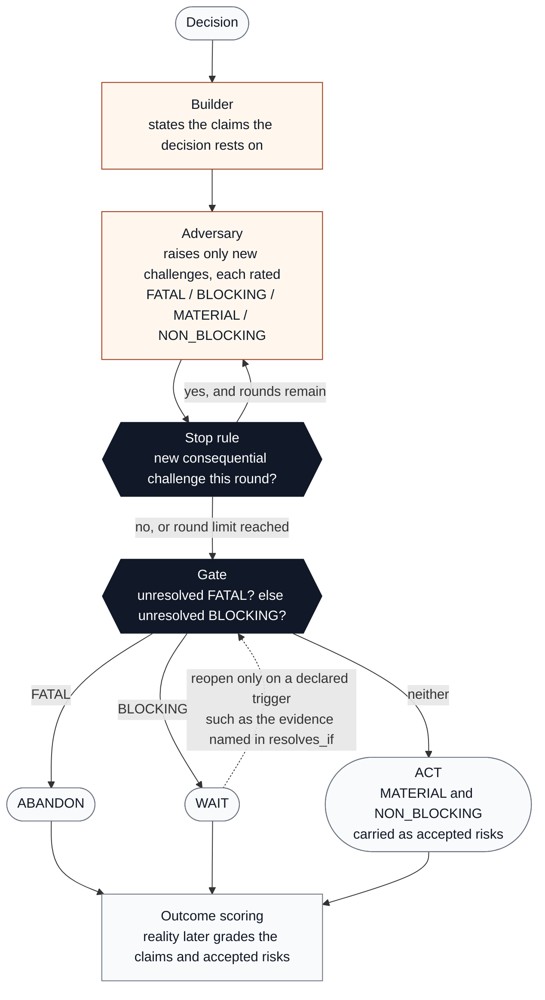

# Decision Gate

An open-source adversarial decision system. Two models argue about a decision. A fixed rule, not a model, decides **ACT / WAIT / ABANDON**. Real outcomes later score the reasoning.

## The idea in three lines

1. **Models argue, a rule decides.** The Builder states what the decision rests on. The Adversary attacks it and rates each objection by what it does to the decision if it stays unresolved. Neither model picks the action.
2. **The review stops when arguing stops changing the answer.** A round that adds no FATAL, BLOCKING, or MATERIAL challenge closes the review. AI can always produce another objection, so the stop is a rule, not a judgment call.
3. **The gate is three lines long**, so every result says which rule fired, which challenges fired it, and exactly what would flip it.

The key question is not "have we eliminated every objection?" It is "do we know enough to take the next action responsibly?"

## How it works



Light boxes are model output. Dark boxes are rules. The models never touch the dark boxes: they cannot end the review early, keep it going, or choose the action.

Every run produces a ledger: the decision, the claims, every challenge with its rating and its `resolves_if`, the round at which the review stopped and why, the rule that fired, and the committed action. The ledger is what gets scored later.

## The deterministic control boundary

The gate is deliberately simple:

```text
IF any unresolved challenge is FATAL
    -> ABANDON
ELSE IF any unresolved challenge is BLOCKING
    -> WAIT
ELSE
    -> ACT
```

MATERIAL and NON_BLOCKING unresolved challenges are preserved as accepted risks.

Every gate result records:

- `action`
- `matched_rule`
- `triggering_challenges`
- human-readable `reasons`
- `accepted_risks`
- `if_triggers_resolved`: the action the gate would return if the triggering challenges were resolved

That makes the result mechanically traceable instead of another model recommendation. Because the gate is a rule, the ledger can state what would change the answer, not just what the answer is.

## Current MVP

The end-to-end vertical slice includes:

1. **Builder** decomposes a user decision into load-bearing claims.
2. **Adversary** generates only new challenges and classifies them FATAL / BLOCKING / MATERIAL / NON_BLOCKING.
3. **Bounded review** stops after a configured round limit or after a round produces no new consequential challenge.
4. **Deterministic gate** converts ledger state into ACT / WAIT / ABANDON. Models do not choose the final action.
5. **First-class rule trace** records which rule fired and which challenge IDs triggered it.
6. **Resolution recipes** are mandatory for unresolved challenges.
7. **Controlled reopen** permits reopening only for declared triggers such as new evidence targeting an unresolved challenge.
8. **Outcome scorer** compares later human-recorded outcomes with original claims and accepted risks.
9. **Local web UI** renders the decision map and lets the user download the resulting ledger.

## Run the UI

```bash
python -m venv .venv
source .venv/bin/activate  # Windows: .venv\Scripts\activate
pip install -e .
decision-gate-web
```

Open `http://127.0.0.1:8000`.

### Demo mode

Demo mode needs no API key. It replays **one fixed worked example** through the real ledger, stop rule, and gate. The Builder and Adversary output is canned, so the decision field is locked to the example and the result is labeled as demo.

The example:

```text
Decision   Should we build a cardiology-focused procedure operations agent?

Builder    5 claims, e.g. "We can get the data" (DEPENDENCY) and
           "Coordination work is a real bottleneck" (ASSUMPTION)

Adversary  Round 1: 3 challenges
             CH-001 BLOCKING      Integration access is not confirmed
             CH-002 MATERIAL      The bottleneck is asserted, not measured
             CH-003 NON_BLOCKING  EHR vendor roadmaps are unknown
           Round 2: nothing new  -> review stops

Gate       WAIT   (rule: UNRESOLVED_BLOCKING, triggered by CH-001)
           If CH-001 is resolved -> ACT, carrying CH-002 and CH-003 as accepted risks
```

Stopping the review and returning WAIT is not a contradiction. The review stops because more argument cannot resolve CH-001. Only the evidence named in its `resolves_if` can, and the ledger says what the gate returns once it does.

Switch to **Live** to review your own decision with real models.

## Run with real models

Decision Gate uses [LiteLLM](https://docs.litellm.ai/) as a provider-neutral adapter.

```bash
pip install -e '.[llm]'
```

Set the provider API keys required by the two model strings you choose, then select **Live models via LiteLLM** in the UI or run:

```bash
decision-gate review \
  "Should we build this product?" \
  --builder-model 'openai/<model>' \
  --adversary-model 'anthropic/<model>' \
  --out decision.json
```

Model names are intentionally user-supplied rather than pinned in the project.

## Inspect the deterministic controls

The first seed decision is intentionally rejected:

```bash
decision-gate validate data/decisions/001-generic-debate-framework.json
decision-gate gate data/decisions/001-generic-debate-framework.json
```

Expected gate:

```text
ABANDON
Matched rule: UNRESOLVED_FATAL
Triggering challenges: CH-001
```

The reframed Decision Gate proposal is a **separate decision**, not a retroactive resolution of the failed thesis:

```bash
decision-gate validate data/decisions/002-build-decision-gate.json
decision-gate gate data/decisions/002-build-decision-gate.json
```

Expected gate:

```text
ACT
Matched rule: NO_UNRESOLVED_FATAL_OR_BLOCKING
```

This distinction matters: changing the proposal creates a new ledger. A fatal challenge to Decision A cannot be “resolved” merely by turning Decision A into Decision B.

## Reopen and outcome scoring

Check whether new evidence is allowed to reopen a closed review:

```bash
decision-gate reopen decision.json --trigger NEW_EVIDENCE --challenge CH-001
```

Score later outcomes:

```bash
decision-gate score decision.json outcomes.json
```

`outcomes.json` uses claim outcomes `HELD | FAILED | UNKNOWN` and risk outcomes `REALIZED | NOT_REALIZED | UNKNOWN` keyed by IDs from the ledger.

A review closes when a stopping condition fires. The existence of another possible objection is not itself a reopen trigger.

## Tests

```bash
python -m unittest discover -s tests -v
```

CI runs the same suite on every pull request.

## Product principle

> Challenge decisions before acting, know when more analysis has stopped being useful, commit to an action, and later let reality score the reasoning.
