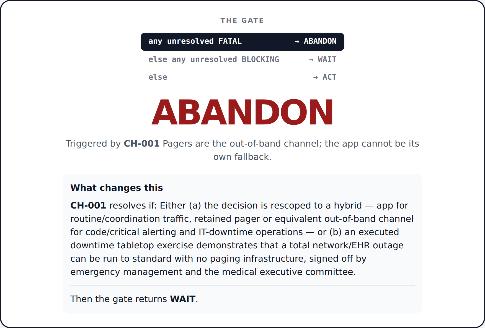
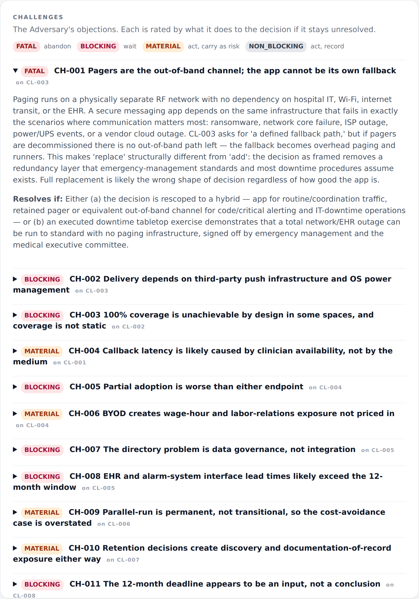
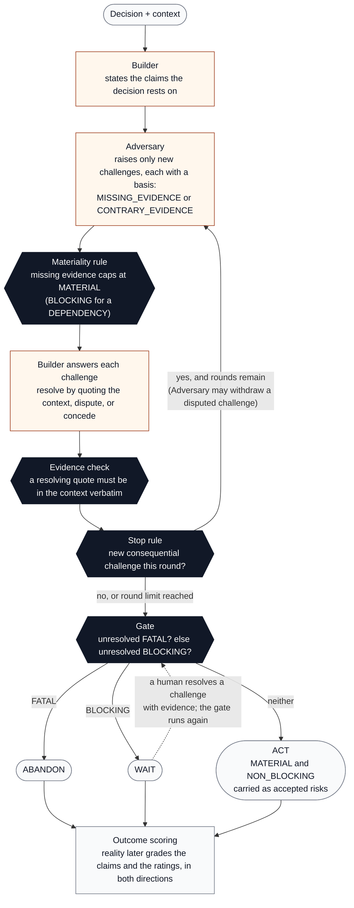
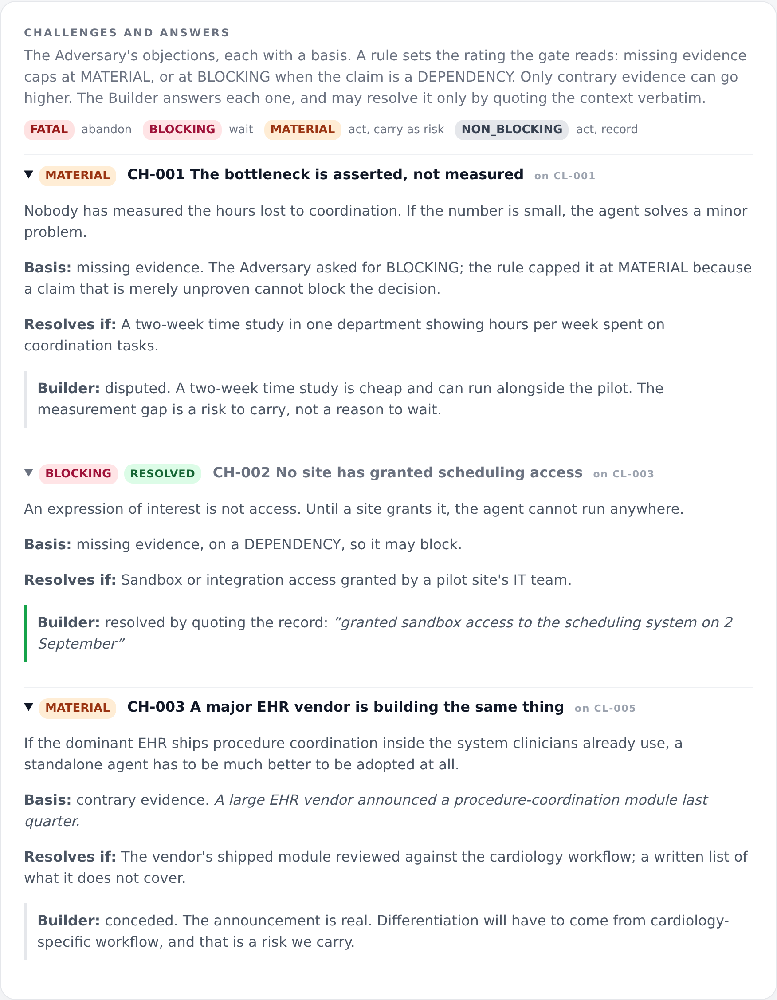
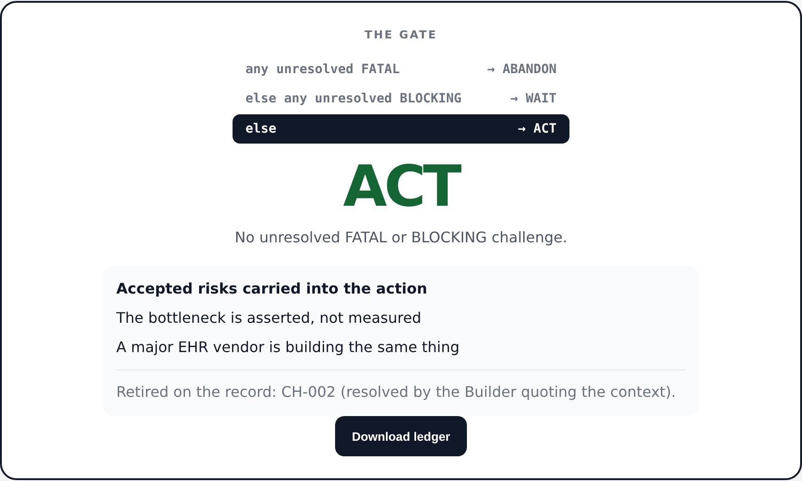
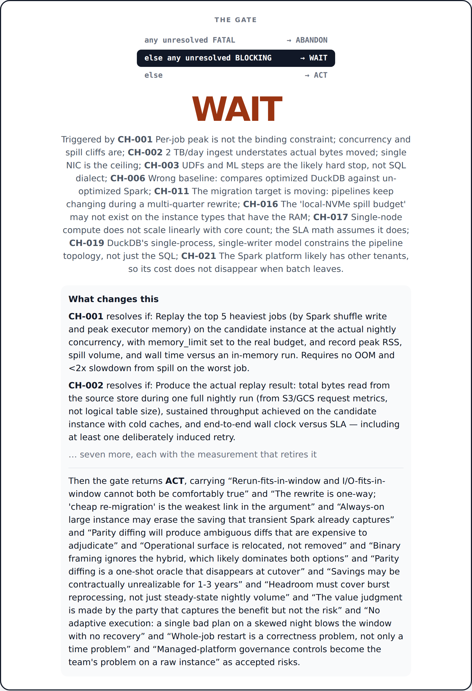

# Decision Gate

An open-source adversarial decision system. Two models argue about a decision. A fixed rule, not a model, decides **ACT / WAIT / ABANDON**. Real outcomes later score the reasoning.

## The idea in four lines

1. **Models argue, a rule decides.** The Builder states what the decision rests on. The Adversary attacks it. The Builder answers. Neither model picks the action.
2. **The burden of proof is symmetric.** A challenge that only says a claim is unproven cannot block the decision: a rule caps it at MATERIAL (BLOCKING when the claim is a DEPENDENCY). Only contrary evidence can go higher. And the Builder can resolve a challenge only by quoting evidence the human put on the record; the quote is checked.
3. **The review stops when arguing stops changing the answer.** A round that adds no FATAL, BLOCKING, or MATERIAL challenge closes the review. AI can always produce another objection, so the stop is a rule, not a judgment call.
4. **The gate is three lines long**, so every result says which rule fired, which challenges fired it, and exactly what would flip it.

The key question is not "have we eliminated every objection?" It is "do we know enough to take the next action responsibly?"

## What's new in 0.3

Version 0.2 had a prosecutor and no defence: the Adversary rated its own objections, most of them said only that a claim was unproven, nothing inside a run could resolve one, and the four live runs never reached ACT. Version 0.3 makes the burden of proof symmetric.

- **Missing evidence cannot block.** A rule caps a challenge that only says "unproven" at MATERIAL (BLOCKING for a DEPENDENCY). Only stated contrary evidence can go higher.
- **The Adversary sees the context**, so evidence already on the record pre-empts a challenge.
- **The Builder gets a turn.** It answers every challenge once and can resolve one only by quoting the context verbatim; the quote is checked. The Adversary may withdraw a disputed challenge.
- **Humans resolve with evidence**, in the CLI or the UI, and the gate runs again with the old commitment kept in history.
- **Scoring cuts both ways**: harsh ratings that never materialised are flagged, not only lenient ones that did.

Details in [Burden of proof](#burden-of-proof). The four live runs in `data/decisions` predate these rules and are kept unedited as the evidence they came from.



*A live run, unedited: Claude Opus 5 as Builder and Adversary on "should a 300-bed hospital replace pagers with a messaging app within 12 months?" One FATAL challenge fires the rule. The ledger says what would change the answer, and that even then the answer is WAIT. [Four such runs are annotated here.](data/decisions/README.md)*



*The Adversary's reasoning is in the ledger, not just its ratings: every challenge carries the argument and the evidence that would retire it.*

## How it works



Light boxes are model output. Dark boxes are rules. The models never touch the dark boxes: they cannot rate their own objections above what their evidence supports, resolve a challenge with words that are not on the record, end the review early, keep it going, or choose the action.

Every run produces a ledger: the decision, the claims, every challenge with its rating and its `resolves_if`, the round at which the review stopped and why, the rule that fired, and the committed action. The ledger is what gets scored later.

## The deterministic control boundary

The gate is deliberately simple:

```text
IF any unresolved challenge is FATAL
    -> ABANDON
ELSE IF any unresolved challenge is BLOCKING
    -> WAIT
ELSE
    -> ACT
```

MATERIAL and NON_BLOCKING unresolved challenges are preserved as accepted risks.

Every gate result records:

- `action`
- `matched_rule`
- `triggering_challenges`
- human-readable `reasons`
- `accepted_risks`
- `if_triggers_resolved`: the action the gate would return if the triggering challenges were resolved

That makes the result mechanically traceable instead of another model recommendation. Because the gate is a rule, the ledger can state what would change the answer, not just what the answer is.

## Burden of proof

The gate reads only unresolved challenges, so whoever controls what counts as an unresolved challenge controls the decision. Two rules keep that from being the Adversary alone.

**The Adversary proposes a rating; a rule disposes.** Every challenge states its basis.

```text
basis = CONTRARY_EVIDENCE  (something specific makes the claim false or unlikely; it must be stated)
    -> materiality as requested, up to FATAL
basis = MISSING_EVIDENCE   (the claim may be true, but nothing on the record shows it)
    -> capped at MATERIAL, or at BLOCKING when the target claim is a DEPENDENCY
```

An absent basis, or contrary evidence with nothing stated, is missing evidence. The ledger records `requested_materiality`, `materiality`, `basis`, `evidence` and `materiality_rule` on every challenge, and `capped_by_rule` on every round, so a cap is as traceable as the gate. The exception for DEPENDENCY claims is deliberate: an unmet precondition outside your control is a legitimate reason to wait, and the Builder chooses which claims carry that kind.

**The Builder answers, but can only resolve with words that are on the record.** After each Adversary round the Builder responds to every open challenge once: RESOLVED with a verbatim quote from the context, DISPUTED with an argument, or CONCEDED. The runner checks the quote against the context; one that is not there is recorded as DISPUTED with the rejection noted. A verified quote flips the challenge to RESOLVED and out of the gate's view. A dispute changes nothing the gate reads, but the Adversary sees it next round and may withdraw the challenge with a reason.

**Humans close challenges with evidence, and the scorer grades both directions.** `decision-gate resolve` appends evidence to the ledger, marks the challenge RESOLVED by HUMAN, keeps the previous commitment in `commitment_history`, and re-runs the gate. Outcome scoring flags challenges rated too low that came true *and* BLOCKING or FATAL challenges that never materialised, so calibration can move toward leniency as well as toward severity.



*The demo's three challenges. The first asked for BLOCKING and was capped to MATERIAL because it only said the claim was unmeasured. The second is a DEPENDENCY, so missing evidence could block it, but the Builder resolved it by quoting the context and the quote was verified. The third brought contrary evidence, kept its rating, and was conceded.*



Why this exists: the four unedited live runs in `data/decisions` produced 92 challenges, 44 of them BLOCKING and none NON_BLOCKING, most of them saying only that a claim was unmeasured, and no path inside a run for a claim to be vindicated. The Adversary set the severity of its own objections and there was no defence. With those rules a review always ends WAIT, whatever the decision. The changes above are the defence.

## What the rule guarantees — and what it doesn't

Being precise about this matters more than the diagram.

**Guaranteed by construction**

- **Termination.** A review ends when a round adds no FATAL, BLOCKING, or MATERIAL challenge, or when the round limit is reached. No model can keep it open.
- **No model chooses the action.** ACT / WAIT / ABANDON is computed from ledger state by three lines of code. Change the code and the ledger says so (`gate: deterministic-v1`).
- **Traceability.** Every result names the rule that fired, the challenge IDs that fired it, and the counterfactual — what the gate would return if those challenges were resolved.
- **Stable reopening.** A closed review reopens only on a declared trigger aimed at a named unresolved challenge. "Someone thought of another objection" is not a trigger.

**Not guaranteed — and where the judgment still lives**

- **The basis and the stated evidence are model output.** The materiality rule guarantees that a challenge with no contrary evidence cannot block or kill the decision. It does not guarantee that evidence the Adversary states as contrary is real, or that the Builder's DEPENDENCY labels are honest. The rule guarantees that the action follows from the record; it does not guarantee the record is true. That is the honest boundary of this design: the models are moved one step further back from the decision, not removed from it.
- **A weak Adversary can starve the stop rule.** If it raises nothing consequential, the review closes early and the gate returns ACT on thin evidence. The round limit bounds cost, not quality.
- **Outcome scoring has no data yet.** The scorer exists; calibration needs resolved decisions with observed outcomes, which take time to accumulate.

What makes those limits tolerable is that the ledger is a document, not a verdict. Every rating shows what was asked and what the rule allowed. A human can resolve a challenge with evidence and re-run the gate, and the ledger records that they did and what they cited. And the outcome scorer later grades exactly the things the models got to decide, in both directions: whether the risks rated acceptable were realized, and whether the challenges used to block were.

## Current MVP

The end-to-end vertical slice includes:

1. **Builder** decomposes a user decision into load-bearing claims.
2. **Adversary** sees the context, generates only new challenges, and states each one's basis and proposed materiality.
3. **Materiality rule** caps missing-evidence challenges so only contrary evidence can block or kill a decision.
4. **Builder rebuttal** answers every challenge once; a resolution must quote the context and is verified.
5. **Bounded review** stops after a configured round limit or after a round produces no new consequential challenge.
6. **Deterministic gate** converts ledger state into ACT / WAIT / ABANDON. Models do not choose the final action.
7. **First-class rule trace** records which rule fired and which challenge IDs triggered it.
8. **Resolution recipes** are mandatory for unresolved challenges.
9. **Human resolve** closes a challenge with evidence, keeps the old commitment in history, and re-runs the gate.
10. **Outcome scorer** grades the ratings in both directions against later human-recorded outcomes.
11. **Local web UI** renders the decision map, lets the user resolve challenges with evidence, and downloads the ledger.

## Run the UI

```bash
python -m venv .venv
source .venv/bin/activate  # Windows: .venv\Scripts\activate
pip install -e .
decision-gate-web
```

Open `http://127.0.0.1:8000`.

### Demo mode

Demo mode needs no API key and never calls a model. It replays **one fixed worked example** through the real materiality rule, evidence check, stop rule, and gate. The Builder and Adversary output is canned, so the decision and context fields are locked to the example and the result is labeled as demo.

The example:

```text
Decision   Should we build a cardiology-focused procedure operations agent?
Context    ... Its IT director granted sandbox access to the scheduling system on 2 September.
           A large EHR vendor announced a procedure-coordination module last quarter.

Builder    5 claims, e.g. "We can get the data" (DEPENDENCY) and
           "Coordination work is a real bottleneck" (ASSUMPTION)

Adversary  Round 1: 3 challenges
             CH-001  asked BLOCKING, missing evidence   -> capped to MATERIAL by rule
                     The bottleneck is asserted, not measured
             CH-002  BLOCKING, missing evidence on a DEPENDENCY
                     No site has granted scheduling access
             CH-003  MATERIAL, contrary evidence (the vendor announcement)
                     A major EHR vendor is building the same thing

Builder    CH-001 disputed: a time study can run alongside the pilot
           CH-002 RESOLVED by quoting the context: "granted sandbox access to the
                  scheduling system on 2 September"  (quote verified)
           CH-003 conceded

Adversary  Round 2: keeps CH-001, nothing new  -> review stops

Gate       ACT   (rule: NO_UNRESOLVED_FATAL_OR_BLOCKING)
           carrying CH-001 and CH-003 as named accepted risks
```

The canned Adversary raises one challenge the context already answers. That is deliberate: real models do it often enough that the rebuttal turn exists. In the UI you can then resolve either remaining risk with evidence of your own, and the gate runs again with the old commitment kept in history.

Switch to **Live** to review your own decision with real models.

**Open a saved ledger.** The file picker under the mode selector renders any ledger JSON, including the live runs in `data/decisions`, without re-running anything. Above the challenge list a tally shows what the Adversary asked for and what is still standing after the rule and the Builder's answers; for a ledger written before the rule it says so. Two browser tabs give you a 0.2 run and its 0.3 re-run side by side.

## Run with real models

Decision Gate uses [LiteLLM](https://docs.litellm.ai/) as a provider-neutral adapter.

```bash
pip install -e '.[llm]'
```

Set the provider API keys required by the two model strings you choose, then select **Live models via LiteLLM** in the UI or run:

```bash
decision-gate review \
  "Should we build this product?" \
  --builder-model 'openai/<model>' \
  --adversary-model 'anthropic/<model>' \
  --out decision.json
```

Model names are intentionally user-supplied rather than pinned in the project.

Live mode calls the providers with the API keys present on the machine running it. Nothing in this repository, and nothing in Demo mode, uses anyone else's account. If you host the UI for other people, host Demo mode only — Live mode on a public host means visitors spend your credits.


## Inspect the deterministic controls

The first seed decision is intentionally rejected:

```bash
decision-gate validate data/decisions/001-generic-debate-framework.json
decision-gate gate data/decisions/001-generic-debate-framework.json
```

Expected gate:

```text
ABANDON
Matched rule: UNRESOLVED_FATAL
Triggering challenges: CH-001
```

The reframed Decision Gate proposal is a **separate decision**, not a retroactive resolution of the failed thesis:

```bash
decision-gate validate data/decisions/002-build-decision-gate.json
decision-gate gate data/decisions/002-build-decision-gate.json
```

Expected gate:

```text
ACT
Matched rule: NO_UNRESOLVED_FATAL_OR_BLOCKING
```

This distinction matters: changing the proposal creates a new ledger. A fatal challenge to Decision A cannot be “resolved” merely by turning Decision A into Decision B.

## Live runs

`data/decisions/003` through `006` are unedited live runs against real
decisions (a hospital replacing pagers, a Spark-to-DuckDB migration, a
congestion-pricing pilot, a bakery's third location), Claude Opus 5 in both
roles. [`data/decisions/README.md`](data/decisions/README.md) annotates each
one and records what the four runs show about the system, including the
uncomfortable parts: the stop rule never fired before the round limit, and
the Adversary never once rated a challenge NON_BLOCKING.

The hospital run is the one ABANDON:

```bash
decision-gate gate data/decisions/003-hospital-messaging.json
```

```text
ABANDON
Matched rule: UNRESOLVED_FATAL
Triggering challenges: CH-001
- Fatal unresolved challenge: Pagers are the out-of-band channel; the app cannot be its own fallback
If triggering challenges were resolved: WAIT
```

The last line is the counterfactual: answer the fatal argument and the
decision is still not ready, because ten BLOCKING challenges remain.

The Spark-to-DuckDB run is the other shape, and the more common one: WAIT
with a computed path to ACT.

```bash
decision-gate gate data/decisions/004-spark-to-duckdb.json
```

```text
WAIT
Matched rule: UNRESOLVED_BLOCKING
Triggering challenges: CH-001, CH-002, CH-003, CH-006, CH-011, CH-016, CH-017, CH-019, CH-021
...
If triggering challenges were resolved: ACT
```

WAIT is not "no". The nine triggering challenges each carry a `resolves_if`,
and together they are the due-diligence plan for the migration: replay the
five heaviest jobs at real nightly concurrency, measure bytes actually read
rather than logical volume, inventory every UDF and prototype the hardest,
cost three options over three years including a tuned-Spark baseline, name
the instance SKU and measure its NVMe, plot the thread-scaling curve, map the
DAG against DuckDB's single-writer model, attribute Spark spend by tenant.
Do those and the gate returns ACT, carrying the thirteen MATERIAL challenges
as named accepted risks that outcome scoring later grades.



None of the four live runs reached ACT unedited. With that Adversary, that
is what the numbers in the annotations predict. The runs predate the
materiality rule and the rebuttal turn (their challenges carry no `basis`),
and they are kept unedited for that reason: they are the evidence the
burden-of-proof rules were built from, and re-running them with context
supplied is the next experiment.

## Resolve, reopen, and outcome scoring

Close a challenge with evidence and re-run the gate:

```bash
decision-gate resolve decision.json --challenge CH-001 \
  --evidence "Replayed the five heaviest jobs at nightly concurrency on 6 Sept: no OOM, 1.4x slowdown from spill."
```

```text
RESOLVED CH-001
Gate: WAIT -> WAIT (UNRESOLVED_BLOCKING)
decision.json
```

The evidence is appended to the ledger's `evidence` list, the challenge records who resolved it and with what, and the previous commitment moves to `commitment_history`.

Compare ledgers, one row each, to see whether the defence did any work:

```bash
decision-gate compare data/decisions/004-spark-to-duckdb.json runs/004-rerun-with-context.json
```

```text
ledger                          ctx  chal  asked F/B/M/N  open F/B/M/N  capped  resolved  withdrawn  gate      if resolved
004-spark-to-duckdb.json*       no   22    0/9/13/0       0/9/13/0      0       0b 0h     0          WAIT (9)  ACT
004-rerun-with-context.json     yes  ...
```

Counts are FATAL/BLOCKING/MATERIAL/NON_BLOCKING. `asked` is what the Adversary requested, `open` is what still stands after the materiality rule and the Builder's answers. A starred ledger predates the rule.

Check whether new evidence is allowed to reopen a closed review:

```bash
decision-gate reopen decision.json --trigger NEW_EVIDENCE --challenge CH-001
```

Score later outcomes:

```bash
decision-gate score decision.json outcomes.json
```

`outcomes.json` uses claim outcomes `HELD | FAILED | UNKNOWN` and risk outcomes `REALIZED | NOT_REALIZED | UNKNOWN` keyed by IDs from the ledger. The score lists `possibly_underestimated_challenges` (rated MATERIAL or below, then realized) and `possibly_overestimated_challenges` (rated BLOCKING or FATAL, then not realized).

A review closes when a stopping condition fires. The existence of another possible objection is not itself a reopen trigger.

## Tests

```bash
python -m unittest discover -s tests -v
```

CI runs the same suite on every pull request.

## Product principle

> Challenge decisions before acting, know when more analysis has stopped being useful, commit to an action, and later let reality score the reasoning.
